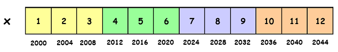
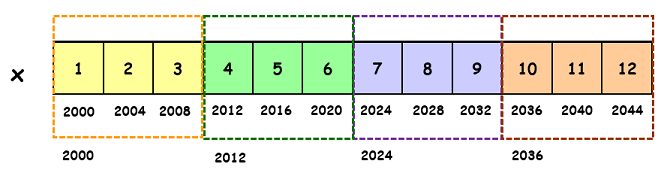

##### Author: Anjali Kumari (MSc. Bioinformatics); Date: 01/02/2021

# Address Arithmetic of Multidimensional Arrays

An example of processing the multidimensional array elements or address arithmetic of multidimensional arrays. Lets assume that the address of x is 2000 (in decimal) and an integer requires four bytes of memory, then find the output of the following program.

## Program in C

```C
#include <stdio.h>
int main()
{
    unsigned int x[4][3] = {{1,2,3}, {4,5,6}, 
                            {7,8,9}, {10,11,12}};
    printf("%u, %u, %u", x+3, *(x+3), *(x+2)+3);
    return 0;
}
```

## Output

```.

2036, 2036, 2036

```

## Visual Representation of array stored in memory





## Explanation-


   * x = Pointer to the first 1D array = 2000
   
  *  x+3 = Pointer to the 4th 1D array = 2000 + 3 * 3 * 4 = 2036
   
   * *(x+3) = Pointer to the 1st element of 4th 1D array = 2036

  *  *(x+2)+3) =

    x = Pointer to the first 1D array

    x+2 = Pointer to the 3rd 1D array

    *(x+2) = Pointer to the 1st element of 3rd 1D array 

    *(x+2) + 3 = 2024 + 3*4 = 2024 + 12 = 2036 
